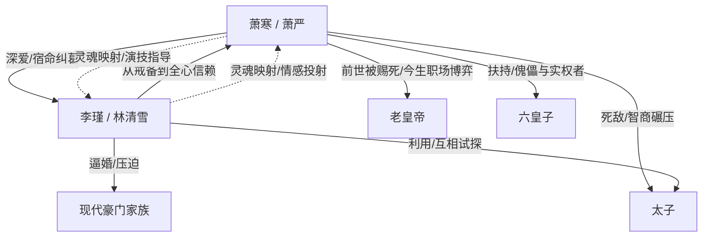

# 再世摄政王 · 人物档案

---

## 核心人物

### 萧寒 / 萧严（男主角）

- **身份**：
  - **前世**：大梁王朝定北侯，天下兵马大元帅（权臣）。
  - **现代**：横店十八线小艺人，后因演技爆红潜力股。
  - **今生**：大梁王朝摄政王，权倾天下的政治家。
- **年龄**：
  - 古代篇：28岁（重生回一年前）。
  - 现代篇章：26岁（肉体年龄）。
- **外貌**：
  - 面如冠玉，剑眉星目，带有常年在战场上养成的肃杀之气。现代时期因保养变得精致，但眼底总有一股化不开的冷意；重生后学会了收敛锋芒，眼神深邃如渊，脸上常挂着三分似笑非笑的“营业假笑”。
- **性格**：
  - **初期**：忠勇刚烈，直男癌晚期，不懂人心险恶，典型的“只懂打仗不懂做人”的莽夫。
  - **中期（现代/重生过渡）**：迷茫中带着困惑，在片场被影后调教后开始觉醒，变得沉稳、内敛，学会了用表情和语言作为武器。
  - **后期（摄政王）**：极度圆滑，深谙职场厚黑学。表面贪财好色、胸无大志，实则心机深沉、杀伐果断。对爱人极度宠溺（爹系男友），对敌人冷酷无情。
- **核心能力**：
  - **武力值**：满阶，单挑无敌。
  - **演技（伪装）**：影帝级别，能把贪官演成忠臣，把权谋演成无奈。
  - **帝王权谋（现代思维加持）**：擅长“向上管理（哄皇帝）”、“向下兼容（收买人心）”、“资源整合（饭局政治）”，具备极强的演讲煽动能力。
- **弱点**：
  - **情感创伤**：前世被长公主（李瑾）“抛弃”的误解，现代看着林清雪（女主现代身）哭泣却无力保护的愧疚，是他心中最痛的点。
  - **表演副作用**：有时候演得太像奸臣，容易导致真正的忠臣误解，需要花更多成本去洗白或解释。
- **人物弧光**：
  - 从一个只会流血牺牲的**“工具人将军”**，经历娱乐圈的洗礼，蜕变为一个懂得利用规则、制定规则的**“操盘手摄政王”**。他的成长不是武力值的提升，而是心智的觉醒：从“我要天下”变为“我要守护我的天下和她”。

---

### 李瑾 / 林清雪（女主角）

- **身份**：
  - **现代**：三金影后，豪门家族大小姐（虽有资源但受家族摆布）。
  - **古代**：大梁王朝长公主，手握部分京畿兵权的实权皇族。
- **年龄**：24岁
- **外貌**：
  - 清冷高贵，美艳不可方物。现代时期常穿高定风衣，气场两米八；古代时期喜着玄色或赤金宫装，眼神凌厉如刀，宛如一朵带刺的黑玫瑰。
- **性格**：
  - **外在**：傲娇毒舌，高岭之花，雷厉风行，对软弱的男人不屑一顾。
  - **内在**：极度缺乏安全感，背负着家族（现代）或皇族（古代）的沉重枷锁，渴望有人能看穿她的坚强并给予真正的依靠。
- **核心能力**：
  - **政治敏感度**：在波云诡谲的朝堂中生存多年，具备极高的警惕性和识人能力。
  - **情报网**：手中掌握着名为“罗网”的暗探势力（古代）。
  - **演技**：现代的影后级别演技，让她在古代的权谋戏码中能迅速跟上萧寒的节奏，两人在朝堂上演“双簧”。
- **弱点**：
  - **家族/软肋**：古代被皇室身份绑架，现代被豪门家族威胁。容易因保护他人而牺牲自己。
- **人物弧光**：
  - 从那个高高在上却孤独无援的**“冰山女神”**，被萧寒融化后，变成敢于反抗命运、与他并肩作战的**“共犯与爱人”**。她从“被动等待保护”到“主动递刀”，是萧寒掌权路上最坚实的后盾。

---

## 重要配角

### 老皇帝（大梁先帝）

- **身份**：大梁王朝现任皇帝。
- **性格**：生性多疑，极度缺乏安全感，典型的“守成之君”加“权术奴”。他宁可要贪财听话的奴才，也不要功高震主的能臣。
- **作用**：萧寒“向上管理”的主要考官。他的存在验证了“情商比能力更重要”的核心逻辑。

### 六皇子（傀儡皇帝 / 后来的新君）

- **身份**：老皇帝第六子，前期透明人，后期新皇。
- **性格**：懦弱、爱读书、无野心，有些许文人风骨但无政治手腕。
- **作用**：萧寒精心挑选的“最佳合伙人”。因为他的软弱，才凸显了摄政王的作用；因为他的无野心，才让李瑾和萧寒能安心掌权。

### 太子

- **身份**：皇长子，前期反派BOSS。
- **性格**：刚愎自用，急功近利，看不起武夫，迷信外戚势力。
- **作用**：推动剧情发展的反派，他的愚蠢衬托了萧寒的高明，他的逼迫给了萧寒“清君侧”的合法性。

### 王经纪人（现代篇配角）

- **身份**：萧严在现代的经纪人。
- **性格**：势利眼，嗓门大，典型的娱乐圈底层混混，唯利是图。
- **作用**：负责在萧寒穿越初期进行“现代文明科普”，制造喜剧冲突和反差萌。

---

## 人物关系图谱

