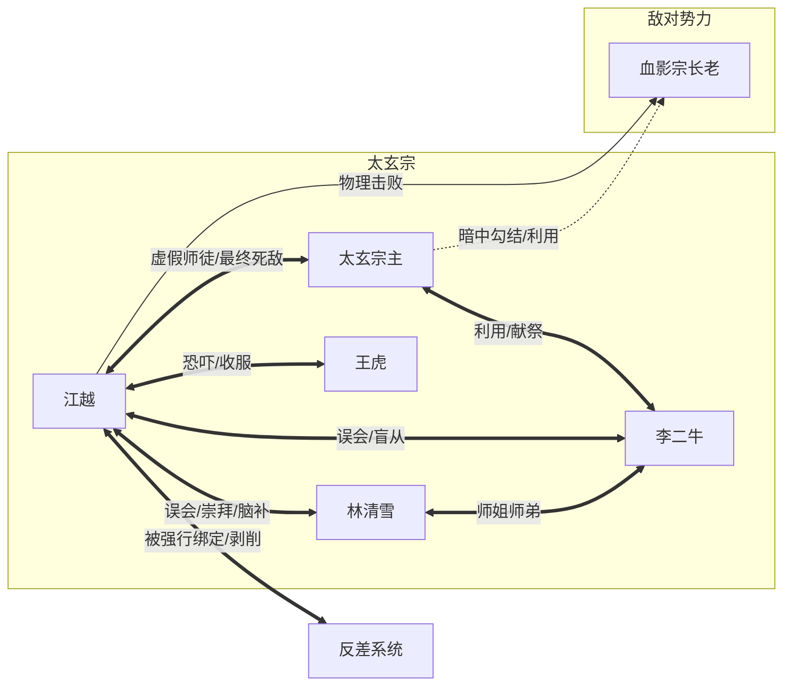

# 反差修仙 · 人物档案

---

## 核心人物

### **江越**（主角）

- **身份：** 
  - 表面：太玄宗内门首席大师兄、正道盟神秘圣子、绝世隐世高人。
  - 真实：现代穿越的学渣、反差系统宿命人、只想躺平的咸鱼。
- **年龄：** 18岁（心理年龄仍处于高三备战期）。
- **外貌：** 
  - 穿越初期：普通的麻袋破布，头发凌乱，眼神总是处于“没睡醒”和“被吓尿”之间切换。
  - 后期：虽然穿着内门锦衣，但总喜欢披着旧被单（美其名曰“返璞归真”），经常脸上沾着锅底灰或辣椒油。
- **性格：** 
  - **表象：** 高深莫测、言简意赅（其实是不知道说什么）、行事不按常理出牌、视功法如粪土（其实是看不懂）。
  - **内在：** 怂（前期）、油嘴滑舌、拥有极强的学渣求生欲、实用主义者。关键时刻重情重义，敢于打破规则。
- **核心能力：** 
  - **反差修真系统：** 制造极大心理落差可获取“反差值”。
  - **学渣知识库：** 物理力学（用来破解剑法）、化学（炼丹炸炉）、现代吐槽（精神攻击）。
  - **道具流：** 擅长使用系统兑换的离谱道具，如《五年高考三年模拟》、生锈菜刀、液压钳等。
- **弱点：** 
  - 系统强制惩罚（反差失败扣修为）。
  - 真正的文化课（看不懂古文修仙秘籍）。
  - 美食诱惑（特别是辣条和灵米烤肉）。
- **人物弧光：** 
  - 从最初为了保命被迫装高人的“瑟瑟发抖伪君子”，到习惯被崇拜的“顺水推舟骗子”，最后在生死存亡之际领悟“大道至简”，褪去光环，以凡人之躯行仙人义举，完成了从“演员”到“真仙”的蜕变。

---

### **林清雪**（女主角）

- **身份：** 太玄宗内门第一天骄、高冷冰山美人、后期主角的专属“脑补帝”。
- **年龄：** 17岁。
- **外貌：** 一袭白衣胜雪，容貌绝美，平时表情冷漠如霜，但在接触到“修仙真谛（主角的歪理）”时会露出罕见的痴迷甚至傻笑。
- **性格：** 
  - **表象：** 高傲、完美主义、对强者极度崇拜。
  - **内在：** 天然呆、极度容易自我攻略、脑补能力十级。一旦接受了某个设定，谁也拉不回来。内心深处渴望摆脱束缚，活得真实。
- **核心能力：** 
  - **太玄冰心诀：** 极具攻击性的冰系剑法。
  - **绝对防御（脑补版）：** 面对主角的一切不合理行为，都能自动脑补成合理的道法解释，免疫精神攻击。
- **弱点：** 
  - 容易走火入魔（因为过度脑补主角的话）。
  - 呆毛（一被夸奖就会脸红，破坏冰山形象）。
- **人物弧光：** 
  - 一开始的视主角为“竖子无礼”，到被指点后的“半信半疑”，再到成为坚定的“信徒”。最终在第三卷中，她不仅见证了主角的真谛，自己也打破了完美偶像的包袱，学会了像个凡人一样大笑和吃路边摊。

---

## 关键配角

### **太玄宗主（伪君子/反派）**

- **身份：** 太玄宗掌门、江越名义上的师尊、正道盟领袖。
- **年龄：** 看起来40岁，实则已过百岁。
- **外貌：** 仙风道骨，白须飘飘，总是慈眉善目，满口仁义道德。
- **性格：** 
  - 极度虚伪、利己主义、为了长生不择手段。
  - 有着极强的表演型人格，比起江越的无意装逼，他是有意地扮演圣父。
- **核心能力：** 
  - **万仙护体大阵：** 表面是守护宗门，实则是献祭弟子的血祭大阵。
  - **血神丹功法：** 通过吞噬弟子和正道修士的精血来维持青春和修为。
- **人物弧光：** 
  - 前期是主角最大的靠山（给了主角首席身份），后期是最大的反派。他的存在本身就是最大的“反差”——看起来最像仙人的其实是魔头。结局被主角以凡人之躯一拳打碎信仰，身死道消。

---

### **李二牛**（搞笑担当/弟子）

- **身份：** 太玄宗内门弟子，原本是勤奋的学霸，后成为主角的头号迷弟。
- **年龄：** 16岁。
- **外貌：** 常年面带菜色（因为刻苦修炼），双眼布满血丝，后来学会了像主角一样瘫在地上晒太阳，反而红光满面。
- **性格：** 
  - 憨厚、死脑筋、过度解读。
  - 一旦认准了道理，就会一条道走到黑。
- **核心能力：** 
  - **不动如山：** 误以为主角让他“盯着石头看”是绝世心法，竟然真的练出了极强的定力，后期不仅修为大涨，还成了沙袋（防御力极高）。
- **人物作用：** 
  - 作为“受害者”展示主角歪理邪说的“真实效果”，侧面烘托主角的“高深”。他的成功是全网最大的误会。

---

### **王虎**（从反派到跟班）

- **身份：** 外门恶霸 -> 主角的专属保镖/保姆。
- **年龄：** 19岁。
- **外貌：** 满脸横肉，身材魁梧，但这身高大汉如今常背着主角的零食袋，一脸谄媚。
- **性格：** 
  - 欺软怕硬（前期）、极度迷信武力、脑回路简单粗暴。
  - 在被主角“一指弹飞”后，彻底沦为主角的死忠粉，认为主角在下一盘大棋。
- **核心能力：** 
  - **王八拳：** 经主角改良（加上物理重心原理），变成了虽丑但实用的街头打法。
- **人物作用：** 
  - 制造早期的冲突，后期作为喜剧调剂，负责在外围吹嘘主角的光辉事迹。

---

### **系统（道具/金手指）**

- **身份：** 江越脑海中的不明人工智能/天道程序。
- **性格：** 
  - 毒舌、冷血、唯利是图、喜欢看热闹。
  - 经常发布莫名其妙的任务，且规则极其死板。
- **台词风格：** 
  - “检测到受众智商下降，反差值翻倍。”
  - “警告：装逼失败，扣除您三年修为，当前修为：炼气一层。”
- **功能：** 
  - 发放任务、兑换道具、评估反差值。
  - **终极功能：【逆天反差】**，能在关键时刻扭曲现实逻辑，辅助主角完成不可能的操作。

---

## 临时/次要角色

### **血影宗长老**

- **身份：** 敌对宗门长老，金丹期修士。
- **定位：** 传统的装逼犯反派。
- **结局：** 被江越用《五年高考三年模拟》物理超度（敲晕），留下了一生的心理阴影，看见数学书就发抖。

---

# 人物关系图谱

### 关系详解

1.  **江越 ↔ 反差系统**：**捕食关系**。系统是捕食者，江越是猎物。系统逼迫江越不断跳出舒适区，制造反差；江越虽然时常吐槽，但依靠系统存活。
2.  **江越 ↔ 林清雪**：**误解与治愈**。江越无意中改变了林清雪刻板的修仙观，林清雪则从最初的崇拜者变成了江越最坚实的后盾和情感寄托。
3.  **江越 ↔ 太玄宗主**：**镜像对立**。两者都是“演员”。宗主是真魔装仙，江越是凡人装神。宗主代表修仙界的腐朽虚伪，江越代表修仙界的真实活力。
4.  **江越 ↔ 众弟子（李二牛、王虎等）**：**乌龙领袖**。江越把带偏了全宗门的风气，弟子们却认为这是得遇明师。这是一种建立在巨大误会上的和谐师徒关系。