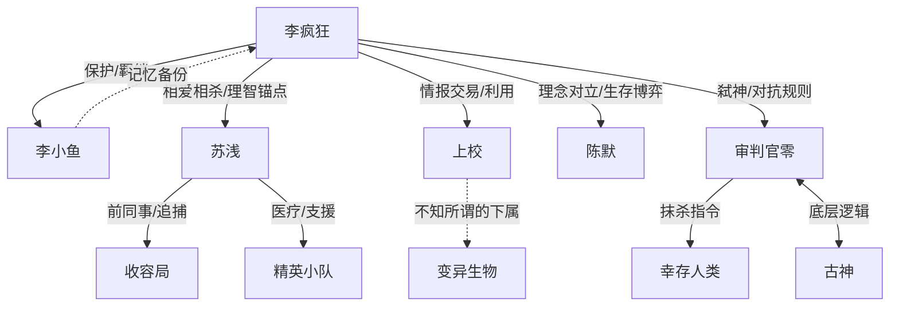

```markdown
# 疯狂星期四 · 人物档案

---

## 核心人物

### 李疯狂（主角）

- **身份**：前社畜程序员 / “记录者”序列觉醒者 / 伪神“理智之主” / 新世界“疯狂星期四”代理人
- **年龄**：26岁
- **外貌**：
    - 清醒日：黑眼圈深重，头发像鸡窝，穿着印着“V我50”的廉价T恤，看起来精打细算且有点丧。
    - 疯狂日（变体）：全身皮肤覆盖流动的黑色代码/符文，左手常异化为不可名状的利爪或餐具，瞳孔变为不断旋转的星云。
- **性格**：
    - **表面**：吐槽役，极度惜命，小市民心态，甚至有点抠门。
    - **内核**：极度理智，果决冷血。在生死关头能毫不犹豫地牺牲非核心资源（包括自己的部分肢体），拥有一种在疯狂中保持逻辑闭环的诡异坚韧。
    - **特质**：黑色幽默大师，习惯用烂梗解构恐怖（例如对着古神喊喊麦）。
- **核心能力**：
    - **【序列·记录者】**：能解析并记录下疯狂日的畸形逻辑，将其转化为技能在清醒日使用（虽然只有1%的功率且副作用大）。
    - **【被动·铁胃】**：能消化包括金属、怪物血肉、概念碎片在内的任何物质，将其转化为San值抵偿剂或能量。
    - **【自创序列·理智之主】**：用绝对的逻辑去解析不可名状之物，能判定古神的行为为“BUG”并予以修复（抹杀）。
- **弱点**：
    - **记忆断层**：每次疯狂日后的断片让他经常背上莫名其妙的黑锅（比如发现自己昨晚竟然是反派教皇）。
    - **锚点依赖**：极度依赖特定的人或物（如妹妹的录音、女主的气息）作为理智锚点，一旦锚点断裂会瞬间堕落。
- **人物弧光**：
    - **起**：为了填饱肚子和活过明天而挣扎的幸存者。
    - **承**：发现世界真相，被迫从“独善其身”变为“领头羊”，在理智与疯狂之间反复横跳。
    - **转**：意识到自己是灾难的源头之一，陷入自我厌恶与弑神意志的矛盾。
    - **合**：牺牲人性中最纯粹的部分，成为管理疯人院的院长，将疯狂关进笼子，独自守护新世界的周四。

---

### 苏浅（女主角）

- **身份**：收容局前王牌调查员 / 叛逃者 / 医疗师 / 李疯狂的“人形镇静剂”
- **年龄**：25岁
- **外貌**：
    - 常年穿着战术风衣，冷艳短发。随着剧情推进，身上会出现由于过度使用力量或被李疯狂波及而产生的异化特征（如左眼变为黑色竖瞳，手臂晶体化）。
- **性格**：
    - **初期**：绝对服从命令的冷酷特工，视李疯狂为高价值样本或危险源。
    - **中后期**：在绝望中觉醒了人性的光辉，成为团队的粘合剂。外冷内热，为了保护重要的人可以背负一切罪责。
- **核心能力**：
    - **【序列·净化者】**（初期）：能通过接触物理清除San值污染。
    - **【异变·精神链接】**（后期）：能与李疯狂共享感官，甚至进入他的精神世界拽他回来。
    - **【概念·牺牲】**：通过代受伤害来转移因果律攻击。
- **弱点**：
    - 情感不仅是理智的锚点，也是最大的软肋。为了李疯狂经常做违反理智的决策。
    - 身体作为容器难以承受高频次的精神介入，后期濒临崩溃。
- **人物弧光**：
    - 从追捕李疯狂的猎人，变成唯一能杀他、也唯一能救他的共犯。在世界重置后，她是唯一记得那个味道的人，即使遗忘也依然会爱上他。

---

### 李小鱼（重要配角/精神支柱）

- **身份**：李疯狂的妹妹 / 高维观测站容器 / 虚构的人格投影
- **年龄**：16岁（外表定格）
- **外貌**：
    - 永远穿着校服，扎着双马尾，手里抱着一只破旧的泰迪熊（肚子里藏着录音笔）。
- **性格**：
    - 天真烂漫，但在末日环境下显出一种诡异的早熟。经常说出让人背脊发凉的天真话语。
- **核心能力**：
    - **【活体U盘】**：她的大脑能存储不被疯狂改写的数据。李疯狂所有的疯狂日记忆备份都存在她脑海里。
- **人物弧光**：
    - 前期作为主角的动力（救妹妹），中期被发现其实早已死亡，现在的存在是主角潜意识投射的具象化。后期成为主角即使想死也不敢死的原因——为了让她活在一个“正常的梦里”。

---

## 重要配角

### “上校”（黑市商人）

- **身份**：地下黑市“老饕食堂”的老板 / 前肯德基加盟商（误） / 信息贩子
- **外貌**：
    - 一个五官位置错乱、全身贴满快餐店Logo的肥胖畸形人。手里总是拿着一只沾满油脂的钢笔。
- **性格**：
    - 贪财、狡诈、中立邪恶。只要出价合适，连亲妈的心跳频率都能卖给你。
- **作用**：
    - 负责发布支线任务、提供剧情信息和兑换稀有道具。是主角了解黑市生态的窗口。

### 审判官“零”（反派/最终BOSS的前哨）

- **身份**：世界的修正程序 / 维度清理者 / 古神的“人事部经理”
- **外貌**：
    - 没有固定形状，通常表现为一团纯白的、带有无数红色印章的光晕，或者是一个穿着黑色西装、脸部是一面镜子的无脸人。
- **性格**：
    - 绝对理性、秩序狂魔、官僚主义。视人类文明为“需要卸载的占用内存”。
- **核心能力**：
    - **【格式化】**：直接抹除存在过的痕迹，将三维生物压扁成二维。
- **作用**：
    - 代表不可抗拒的规则力量。主角不仅要对抗怪物，还要对抗这个试图“关服”的世界管理员。

### 陈默（“方舟”车长）

- **身份**：移动避难所“诺亚方舟”的指挥官 / 半机械改造人
- **性格**：
    - 独断专行的实用主义者。为了集体的存续可以毫不犹豫地牺牲掉1%的掉队者。
- **作用**：
    - 与主角“即使牺牲自我也要守护个体”的理念冲突。是“生存 vs 人性”这一矛盾的具体化身。

---

## 人物关系图谱



**关系详解：**

1.  **李疯狂 ↔ 苏浅**：典型的“疯子与保姆”模式。苏浅是唯一敢在李疯狂发疯时扇他耳光，也唯一敢在他清醒时给他递刀的人。两人的关系建立在无数次互相背对背作战的信任之上。
2.  **李疯狂 ↔ 李小鱼**：不仅是兄妹，更是“观测者”与“被观测者”。小鱼的存在是李疯狂确认自己还拥有人性的唯一证据。
3.  **李疯狂 ↔ “上校”**：纯粹的利益共同体，但偶尔流露出一种诡异的“老顾客”友谊。
4.  **李疯狂 ↔ 审判官零**：Bug与杀毒软件的关系。李疯狂是这个世界的错误，而零是来修复错误的，但最后李疯狂证明了错误才是世界的真谛。

---
```