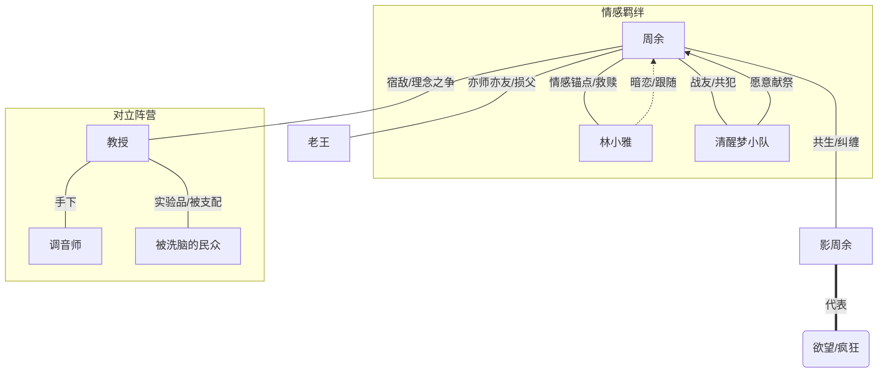

# 疯狂序列 · 人物档案

---

## 核心人物

### 周余（主角）

- **身份**：
    - 表层：某不知名广告公司文案策划、兼职收容所编外特工。
    - 深层：序列 0-01 “旁观者”-> “导演” -> “双面人”。
    - 终局：人类最后的守梦人、唯一的清醒者。
- **年龄**：26岁
- **外貌**：
    - 清醒期：黑眼圈极重，头发像鸟窝，眼神总是游离在涣散与锐利之间，穿着不仅不合身甚至经常少一只袖子的廉价西装（因为疯狂期总弄坏）。
    - 疯狂期（影子）：举止优雅，燕尾服笔挺，脸上常挂着令人毛骨悚然的完美微笑，瞳孔呈现异样的漩涡状。
- **性格**：
    - 表面：丧系青年，吐槽役，极其怕死，习惯用黑色幽默来消解恐惧。
    - 内在：有着极其扭曲的责任感，看似疯批实则极度渴望守护某种“正常的温情”。为了生存可以毫无底线地利用规则，但在关键时刻又会为了“人性”这种虚无缥缈的东西牺牲一切。
- **核心能力**：
    - **【理性回溯】（初期）**：通过触碰残留的疯狂痕迹，短暂回放过去的视听信息。
    - **【旁观者】（进阶）**：绝对冷静的视角，可以预判敌人的动作轨迹（看到几秒后的残影），免疫大部分精神类幻觉。
    - **【导演】（中阶）**：将现实视为“片场”，可以剪辑局部空间（如让爆炸延迟两秒发生，或者将两个物体的空间位置互换），高阶状态下可改写物理规则。
    - **【双面人】（高阶）**：完全接纳体内的疯狂人格，理智与疯狂无缝切换，甚至可以同时存在。
- **弱点**：
    - **San值阈值**：每次使用能力都在透支理智，过度使用会分不清现实与剧本。
    - **记忆磨损**：为了借用疯狂的力量，必须不断献祭自己的记忆（童年、初恋等）。
- **人物弧光**：
    - 从一个只想在末日苟延残喘的普通人，被迫卷入拯救世界的漩涡。
    - 始于恐惧，终于孤独。他从一个试图寻找解药的病人，变成了为了维系人类最后一点美梦而独自坐在废墟王座上的神。他的成长是对“何为真实”的不断解构与重构。

---

### 林小雅 / 林鹿（女主角/情感锚点）

- **身份**：收容所特工、周余的“导盲犬”、旧神眷属的克星。
- **年龄**：约20岁（具体不详，来历成谜）
- **外貌**：拥有一头银白色的短发，眼神清澈空洞得像玻璃珠。通常穿着 overly size 的卫衣，身上总是系着一条红色的领带（那是周余第一个疯狂日留下的唯一“正常”礼物）。
- **性格**：
    - 三无少女（无口无心无表情），说话简短毒舌。
    - 对周余有着近乎本能的依赖和执着，这并非爱情，而是一种溺水者抓住浮木的生存本能。
    - 极度的吃货，但只吃面包和植物（因为吃肉会让她想起某些恶心的消化过程）。
- **核心能力**：
    - **【灵视】**：天生的“纯净者”，能直接看到事物的本质（比如周余身上的阴影、隐藏的裂缝）。
    - **【净化/稳定】**：她的存在本身就是一种“理智镇定剂”，触碰她可以让周余在疯狂中短暂找回自我。
    - **【肉身容器】**：后期揭示她可以容纳极高浓度的污染而不异变，是完美的“容器”。
- **弱点**：
    - 身体极度虚弱，经常因为透支能力而陷入昏迷甚至透明化（存在感消失）。
    - 没有痛觉，导致往往是重伤后才被发现。
- **人物弧光**：
    - 最初是需要被保护的奇怪少女，逐渐成为周余心中“人性”的最后一块拼图。
    - 她不仅见证了周余的堕落与升华，最终在“永恒的星期八”中作为唯一的“非理性”存在，成为周余编织梦境的蓝本。

---

### 老王（王大锤）（核心配角/损友）

- **身份**：周余的邻居、收容所特聘“食材处理专家”、疯狂日的一区屠夫。
- **年龄**：50岁左右
- **外貌**：
    - 平时：穿着大白背心、手里提着鸟笼的大叔，慈眉善目，两鬓斑白。
    - 疯狂期：身高三米，背着一把生锈的斩骨刀，浑身缠绕着围裙状的血肉触手。
- **性格**：
    - 极其务实的生活派，信奉“能吃就是福”。
    - 看似大大咧咧，实则内心通透。他总能用最市井的哲学消解最深沉的绝望。
    - 对周余有一种类似父辈又类似饲主的关怀。
- **核心能力**：
    - **【万物皆可炖】**：可以将任何有机物转化为某种“高能量炖品”，吃下后可快速恢复体力或短暂抵抗污染。
    *【屠夫之怒】**：力量型强化，斧头拥有破魔属性。
- **弱点**：
    - 太贪吃，容易被高阶怪物的“诱饵”吸引。
    - 因为活得太久，反而对末日感到一种麻木的疲惫。
- **人物弧光**：
    - 代表了普通人面对末世的“适应性”。
    - 在周余黑化最严重的时候，他是唯一没把周余当怪物看的人。最终为了掩护周余，在时间悖论中变成守护王座的怪物眷属，完成了最后的守护。

---

### 影周余（第二人格/最终Boss前期）

- **身份**：周余的潜意识具象化、疯狂期的主导意识。
- **年龄**：与周余同龄，但心理年龄极其古老。
- **外貌**：与周余长相一致，但总是穿着剪裁完美的黑色礼服，举止优雅得像个英国绅士，只是手上常戴着沾血的白手套。
- **性格**：
    - **混乱中立**。认为逻辑是累赘，疯狂才是自由。
    - 极度自恋，喜欢戏剧性的登场，认为世界就是一个巨大的游乐场。
    - 对“清醒周余”没有杀意，反而觉得他很可怜，经常试图“帮”他解脱（即彻底疯掉）。
- **核心能力**：
    - **【镜面折射】**：可以反弹精神攻击，并在任何镜面物体中穿梭。
    - **【混乱剪辑】**：不需要遵循逻辑，凭空制造荒诞的现象（如让天上下起刀子雨，或者让敌人变成巨大的香蕉）。
- **弱点**：
    - 无法在绝对理性的环境中存在（会被削弱）。
    - 必须依附于周余的身体或实体化的阴影。
- **人物弧光**：
    - 从最初的夺舍威胁，到后来的被迫合作，最后达成“共生”。
    - 他代表了周余内心被压抑的欲望和破坏冲动。最终周余接纳了他，意味着人性的完整——不再抗拒疯狂，而是学会驾驭它。

---

## 强力反派

### 教授（陈默）（智囊型反派）

- **身份**：大学心理学教授、“新伊甸”创立者（园丁）、诺亚号实际掌控者。
- **年龄**：45岁
- **外貌**：儒雅斯文，戴着金丝眼镜，穿着考究的三件套西装，总是面带微笑。但他没有影子（或者是影子的形状在不断变化）。
- **性格**：
    - **极致的理性主义者**。认为痛觉、恐惧、情感是阻碍人类进化的低级bug。
    - 充满神性的慈悲，愿意为了“大义”牺牲任何人，包括自己。
    - 说话喜欢引经据典，有着极强的忽悠能力。
- **核心能力**：
    - **【脑叶修剪】**：通过言语或特定的声波，切断人的情感神经，使其变成绝对理性的“工蚁”。
    - **【剧本创作】**：高阶“导演”类能力，但他写的是“必然发生的悲剧”，一旦被他设定好结局，极难更改。
- **弱点**：
    - 无法理解非理性的情感（如爱、牺牲），这导致他在计算周余的行为时经常出现偏差。
- **人物弧光**：
    - 试图建立一个没有痛苦也没有欢乐的永恒乌托邦。
    - 最终被周余证明：痛苦是活着的证明。他在生命的最后时刻，选择相信了周余那个“星期八”的谎言，带着对自由的渴望死去。

### 调音师（执行型反派）

- **身份**：安息会高层执行者、声音操控大师。
- **外貌**：穿着朋克风格的风衣，脖子上的声带是外露的金属结构，拿着两根巨大的音叉。
- **性格**：暴躁狂躁，认为世界是一首走调的曲子，必须暴力修正。
- **核心能力**：【共振】。通过声音引发内脏破裂、建筑崩塌，甚至让空气凝固成固体。

---

## 重要队友（清醒梦小队）

### 缝尸人

- **身份**：黑市医生 / 清醒梦小队队员。
- **性格**：沉默寡言，对“人体结构”有着变态的迷恋。喜欢在战斗中进行艺术创作。
- **能力**：【万物缝合】。不仅能缝合伤口，能缝合空间（像缝衣服一样把两个地点连起来），甚至缝合敌人的肢体与武器。

### 瘾君子

- **身份**：序列者成瘾者 / 清醒梦小队突击手。
- **性格**：一刻也停不下来，语速极快，战斗狂。只有在杀戮中才觉得活着。
- **能力**：【超频】。通过透支生命力和污染度，在短时间内获得指数级的能力提升，代价是战斗后会极度虚弱甚至退化成婴儿。

### 哑巴

- **身份**：失声的孤儿 / 清醒梦小队支援。
- **性格**：胆小但忠诚，喜欢躲在队友身后。
- **能力**：【咆哮】。他的嗓子能发出针对精神污染的高频声波，震碎幻觉和低阶怪物的核心。

---

## 人物关系图谱

*(注：由于Mermaid图在部分Markdown查看器中可能不渲染，上述结构展示了周余处于中心，与自己的影子共生，与林小雅和清醒梦小队有深刻羁绊，与教授处于核心对立面。)