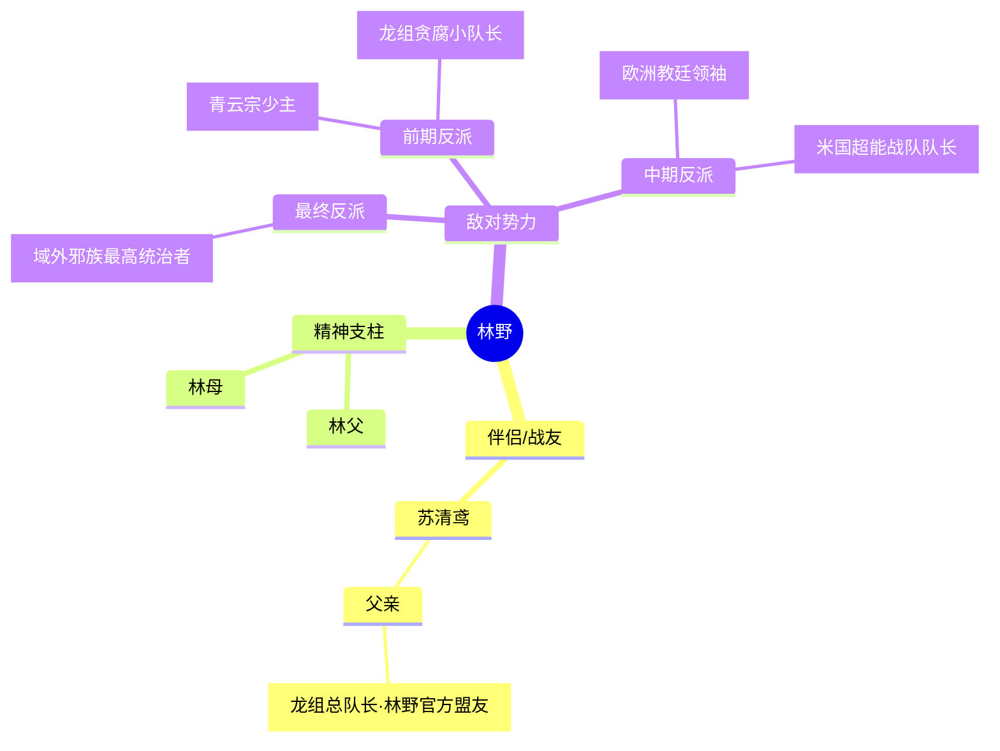

# 返祖神皇 · 人物档案

---

## 核心人物

### 林野（主角）
- **身份**：开局为刚毕业的底层社畜，意外绑定上古返祖系统，成为上古华夏血脉传承人，最终成就「返祖神皇」
- **年龄**：开局22岁，结局26岁
- **外貌**：开局是身形偏瘦、带黑眼圈的普通青年，觉醒血脉后身高拔至185cm，轮廓硬朗，常年穿休闲装，动用力量时周身环绕暗红色血气，眼神锐利有压迫感
- **性格**：杀伐果断、有仇必报、零圣母心，护短属性点满，极度厌恶特权阶层，不慕虚名，本心只想和家人过安稳日子
- **核心能力**：绑定上古返祖系统，接触上古遗珍即可直接解锁对应大能血脉，先后解锁蚩尤、刑天、后羿、夸父、女娲、盘古等12位上古顶尖大能的100%血脉，拥有霸体、狂血、不死神通、射日、逐日、造化、开天辟地等全部上古神通，最终突破至创世级战力，为全球最强者
- **弱点**：前期刚觉醒时不熟悉系统规则容易被暗算，后期唯一软肋是父母和苏清鸢，只要对方触碰家人底线就会彻底暴走
- **人物弧光**：从天天被老板压榨、为母亲医药费发愁的底层社畜，被迫卷入灵气复苏危机，一路横推异兽、邪修、境外势力，打破上古众神定下的救世宿命，拒绝全球共主的权位，回归普通生活，实现「想上班就上班，想救世就救世」的自由人生

### 苏清鸢（核心女配角/女主）
- **身份**：龙组总队长苏振国之女，林野的战友、后期伴侣，全球第二战力
- **年龄**：开局18岁（刚高考完），结局22岁
- **外貌**：长相清甜，常年扎高马尾穿作训服，身手利落，突破SS级战力后周身环绕淡青色灵力光晕，佩戴林野赠送的女娲玉钗
- **性格**：是非分明、杀伐果断、绝不拖后腿，崇拜林野，明事理不矫情，对普通人有共情心
- **核心能力**：龙组正统修行功法，擅长箭术，后期获得后羿弓副品、女娲玉钗加持，战力突破至SS级，是林野最信任的搭档
- **弱点**：前期战力不足时容易被高阶邪修偷袭，最在意林野的安危，会为了保护林野不顾自身安全
- **人物弧光**：从开局被异兽吓呆的娇小姑娘，被林野救下后励志变强，成长为能独当一面的龙组核心战力，全程和林野并肩作战，战后随林野回归普通生活，陪他照顾父母

---

## 重要配角

### 苏振国
- **身份**：龙组总队长，苏清鸢父亲，华夏官方修行势力最高负责人
- **年龄**：50岁
- **外貌**：国字脸，常年穿军装，不怒自威，手上有常年握枪磨出的老茧
- **性格**：刚正不阿、爱国重义，前期恪守规则，后期完全信任林野，是林野和官方之间的核心纽带
- **核心能力**：A级巅峰战力，拥有龙组最高调度权，可调动全国官方修行资源和军队
- **弱点**：前期过于顾及规则情面，对龙组内部的贪腐长老没有及时清理，差点酿成大祸
- **人物弧光**：从一开始按规矩办事的官方领导，逐渐被林野的能力和品性折服，放下偏见全力支持林野，战后主导全球修行秩序重建，推动华夏修行界成为全球核心主导

### 林父&林母
- **身份**：普通工薪阶层，林野的父母，林野的精神支柱
- **年龄**：林父48岁，林母47岁
- **外貌**：就是普通的中年夫妇，衣着朴素，手上有常年干活的痕迹
- **性格**：善良老实，知足常乐，从来不过问林野的工作内容，只叮嘱他注意安全，不拖后腿
- **核心能力**：无修行能力，就是普通凡人
- **弱点**：没有战力，多次被反派盯上当作要挟林野的人质
- **人物弧光**：从一开始为医药费发愁的普通老百姓，哪怕儿子成了全球最强也依旧保持本心，每天买菜做饭，是林野放弃权位回归普通生活的核心原因

### 青云子（前期核心反派）
- **身份**：青云宗少主，老牌修行宗门特权阶层代表
- **年龄**：25岁
- **外貌**：穿绣云纹白道袍，长相俊朗但眼神阴鸷，常年带宗门弟子招摇过市
- **性格**：嚣张跋扈，看不起散修和平民，自私自利，为了抢遗珍不择手段，后期勾结邪族报仇
- **核心能力**：青云宗正统修行功法，A级战力，持有青云宗镇派法器青云剑
- **弱点**：心胸狭窄，易怒轻敌，仗着宗门背景目中无人
- **人物弧光**：从高高在上的宗门少主，多次挑衅林野、欺压普通人，最终在昆仑山遗迹抢刑天干戚时被林野当场斩杀，青云宗全族也因为勾结邪族被林野灭门

### 张磊（前期反派）
- **身份**：龙组东海分队小队长，龙组内部贪腐特权阶层代表
- **年龄**：30岁
- **外貌**：满脸横肉，穿龙组作训服，习惯摆官架子
- **性格**：贪婪跋扈，仗着官方身份欺压平民，勾结黑市走私异兽材料，为了抢功劳不择手段
- **核心能力**：E级战力，拥有龙组基层调度权
- **弱点**：本事不大野心大，贪心不足
- **人物弧光**：开局想抢林野的蚩尤指骨、逼林野交功劳，被林野曝光黑料送进监狱，其父亲（龙组长老）后来勾结邪修想暗杀林野报仇，父子二人双双被林野当众处决

### 邪族神皇（最终BOSS）
- **身份**：域外邪族最高统治者，千年前被上古众神封印的最终反派
- **年龄**：上万岁
- **外貌**：身高百丈，暗金色皮肤，头生双角，周身缠绕黑色魔气，声音震得空间开裂
- **性格**：残暴嗜杀，自负傲慢，看不起人类和上古华夏文明，妄图占领地球作为邪族殖民地
- **核心能力**：半步创世级战力，可操控魔气腐蚀万物，一击能轰碎半座城市
- **弱点**：极度轻敌，看不起上古华夏血脉的力量，对盘古创世血脉毫无防备
- **人物弧光**：千年前被上古众神集体献祭封印，封印松动后破封而出，本以为能横扫地球，被100%解锁盘古血脉的林野当场捏成飞灰，入侵的邪族大军被全灭

### 教皇（中期西方反派）
- **身份**：欧洲教廷最高领袖，西方修行势力代表
- **年龄**：70岁
- **外貌**：穿白金教皇袍，手持十字权杖，表面慈眉善目实则阴险虚伪
- **性格**：贪婪虚伪，想称霸全球修行界，多次联合西方势力挑衅林野，暗中勾结邪族
- **核心能力**：SS级战力，掌握光明系神通
- **弱点**：欺软怕硬，极度怕死
- **人物弧光**：多次联合黑暗议会、米国超能战队抢华夏遗珍，挑衅林野权威，被林野隔空一巴掌拍平半个梵蒂冈后彻底服软，战后老老实实归顺华夏修行界的管理

### 杰森（中期境外反派）
- **身份**：米国超能战队队长，西方种族主义势力代表
- **年龄**：35岁
- **外貌**：金发肌肉男，穿高科技作战服，满脸傲慢
- **性格**：嚣张跋扈，极端种族歧视，公开放话「黄种人不配持有上古遗珍」
- **核心能力**：SS级战力，拥有激光炮、超级力量异能
- **弱点**：轻敌自大，看不起华夏修行者
- **人物弧光**：在埃及金字塔抢夸父手杖时多次挑衅林野，被林野一拳爆颅，整个超能战队几乎被林野全灭，米国官方再也不敢公开挑衅林野

---

## 人物关系图谱
